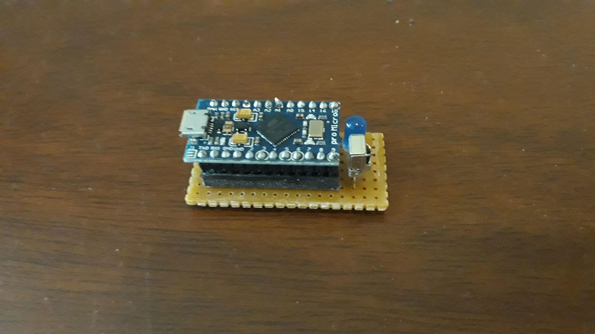
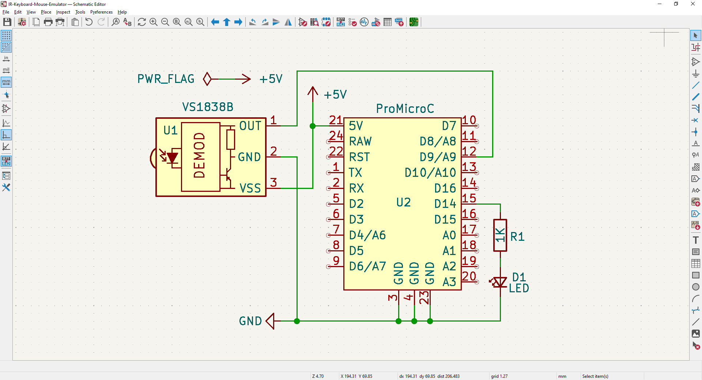
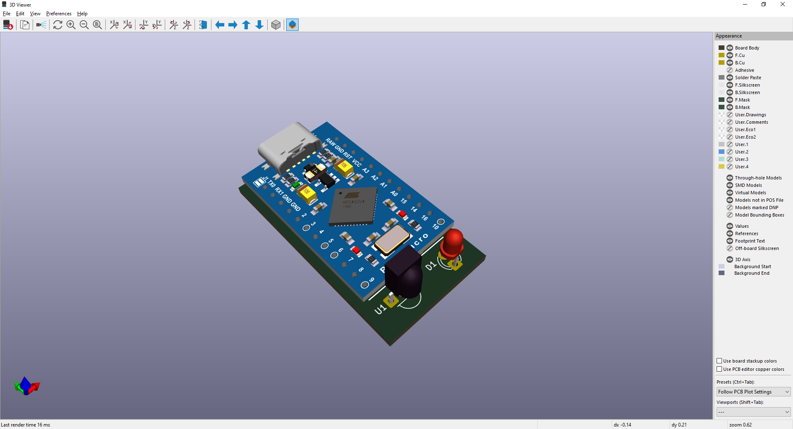
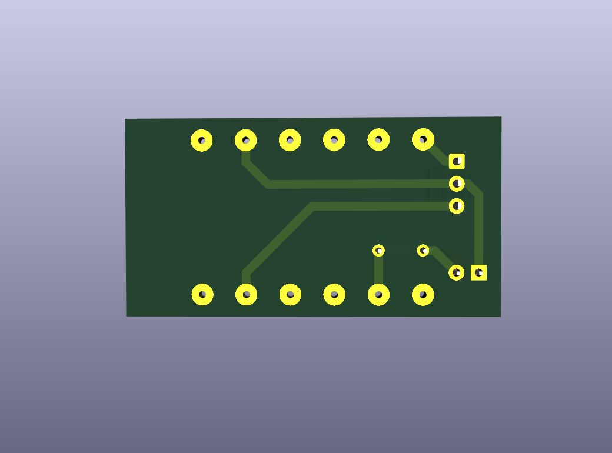
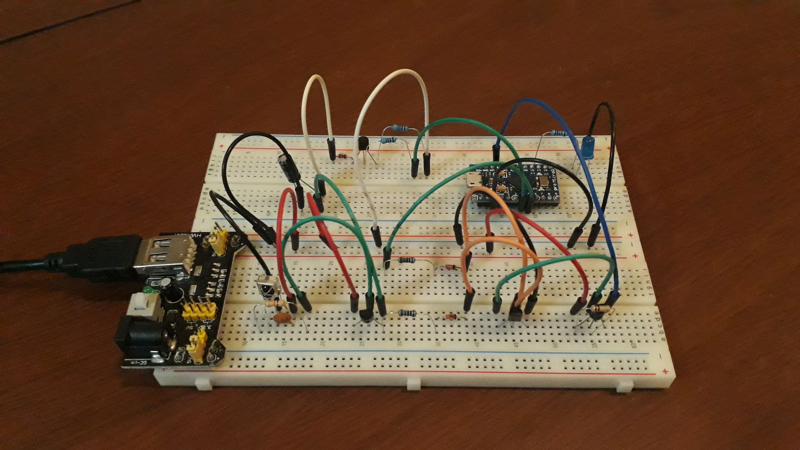
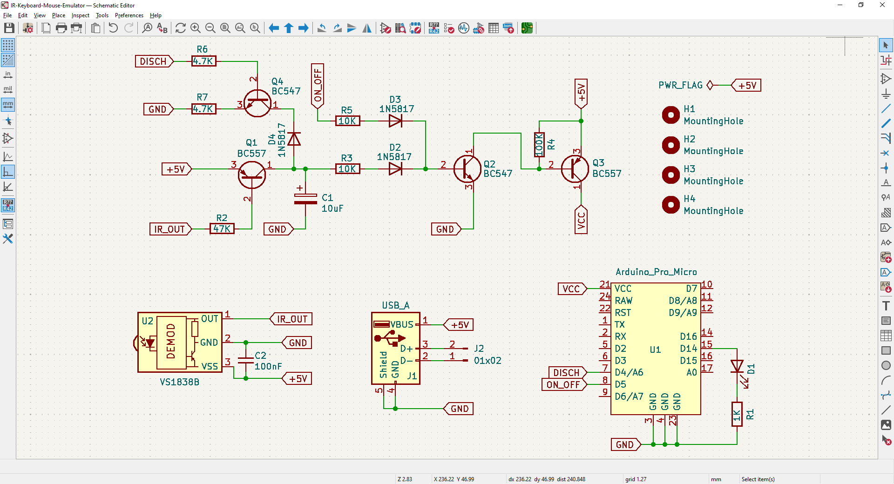

# IR Keyboard+Mouse Emulator

Electronic project for use a IR Remote Control to control a Home Theater PC (HTPC) based on Arduino PRO Micro.  
Schematics diagram + PCB diagram (KiCAD 9) and case 3D model (Blender) are also provided.

This project is a **work-in-progress**.

&nbsp;

General commands:
- Key Lock/Unlock (to avoid collition with regular TV usage).
- Key Esc
- Key Close (close current program)
- Mouse Change Speed
- Mouse Left Click
- Mouse Right Click
- Mouse MoveUp
- Mouse Move Right
- Mouse MoveDown
- Mouse MoveLeft

Media commands
- Media Player (open VLC media player)
- Media Play/Pause
- Media Stop
- Media Forward (moves forward 10 seconds)
- Media Rewind (moves backwards 10 seconds)
- Media Previous (moves forward 1 minute)
- Media Next (moves backwards 1 minute)
- Media Volume Mute
- Media Volume Up
- Media Volume Down

Miscellaneous commands
- MyPC (opens MyPC)
- Calculator (open Calculator);

Features:
- Dump of IR Codes (protocols: RC5, RC6, NEC, SONY, PANASONIC, LG, JVC, WHYNTER)

Benchmarks:

| Arduino PRO Micro                 | Tipical consumption |
|-----------------------------------|---------------------|
| Normal mode                       |            37-38 mA |
| ADC + SPI + TWI disabled          |            35-36 mA |
| USB detach + Clock @2 MHz         |            19-20 mA |
| USB detach + SLEEP_MODE_PWR_DOWN  |              4-5 mA |

I am currently working on incorporating a hardware low-power version.

&nbsp;

The 'Allways ON' version uses the following electronic components:
- 1 x Arduino PRO Micro
- 1 x IR Receiver VS1838
- 1 x LED 3mm
- 1 x 1k ohm resistor

The 'Low Power' version uses the following electronic components:
- 1 x Arduino PRO Micro
- 1 x IR Receiver VS1838
- 1 x LED 3mm
- 1 x 1k ohm resistor
- 1 x 47k ohm resistor
- 2 x 10k ohm resistor
- 1 x 100k ohm resistor
- 2 x 4.7k ohm resistor
- 3 x schottky diode 1N5817
- 2 x BC547 PNP transistor
- 2 x BC557 NPN transistor
- 1 x USB Type A female connector
- 1 x Bornier 2-pins / JST connector 2-pins

&nbsp;

### Screenshots - Version Allways ON

| Breadboard                                           | Assembly                                             |
|------------------------------------------------------|------------------------------------------------------|
|           |             |

| Schematics Diagram                                   | PCB Diagram                                          |
|------------------------------------------------------|------------------------------------------------------|
|   |          |

| PCB Render 3D                                        | PCB Render 3D                                        |
|------------------------------------------------------|------------------------------------------------------|
|  |   |

| Case 3D Model                                        | Project Final                                        |
|------------------------------------------------------|------------------------------------------------------|
|        |        |

&nbsp;

### Screenshots - Version Low Power

| Breadboard                                           | Assembly                                             |
|------------------------------------------------------|------------------------------------------------------|
|            |                    |

| Schematics Diagram                                   | PCB Diagram                                          |
|------------------------------------------------------|------------------------------------------------------|
|    |                          |

| PCB Render 3D                                        | PCB Render 3D                                        |
|------------------------------------------------------|------------------------------------------------------|
|                    |                    |

| Case 3D Model                                        | Project Final                                        |
|------------------------------------------------------|------------------------------------------------------|
|                    |                    |

See 'Rescources' sub-folder for more pictures & videos of the project.

&nbsp;

### Version History

v1.0 (2025.12.18) - Initial release.  
v1.1 (2025.12.19) - Adding case 3D model.  
v1.2 (2025.12.22) - Update schematics and PCB.  
v1.3 (2025.12.29) - Firmware refactor for code clean-up.  
v1.4 (2026.01.02) - Adding Low Power protoboard & schematics diagram.  

&nbsp;

This source code is licensed under GPL v3.0  
Please send me your feedback about this project: andres.garcia.alves@gmail.com
