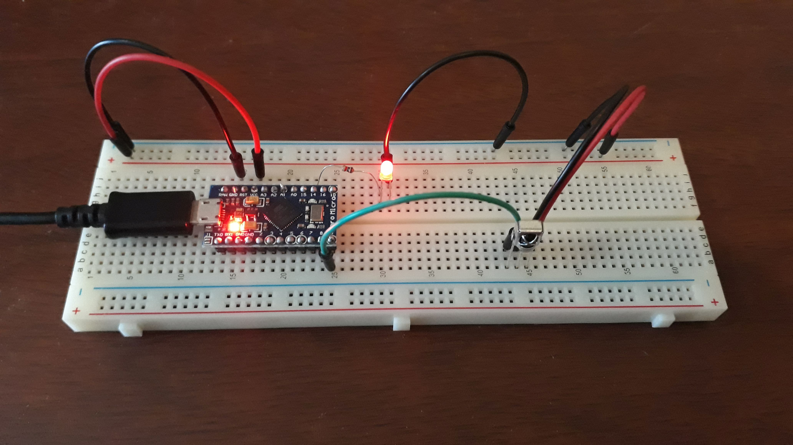
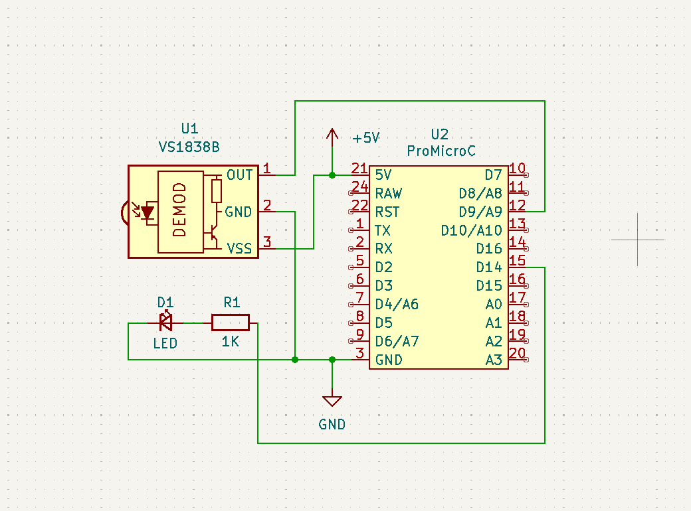
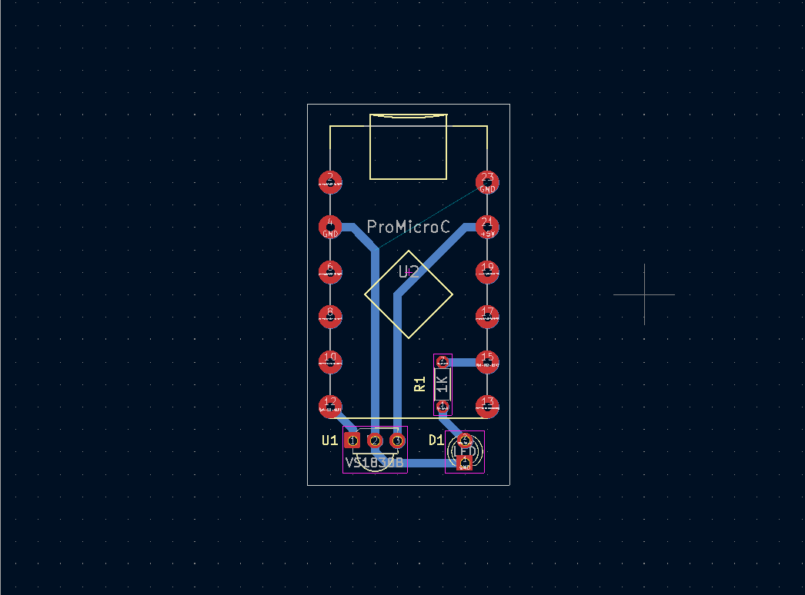
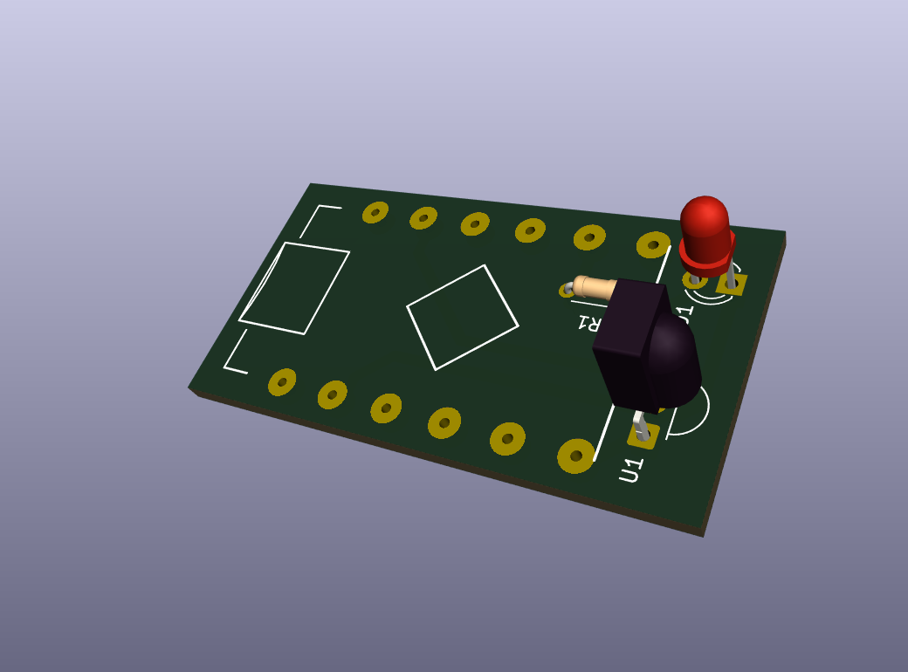
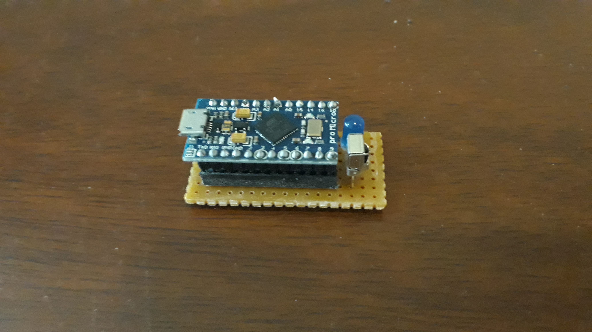

# IR Keyboard+Mouse Emulator

Electronic project for use a IR Remote Control to control a Home Theater PC (HTPC) based on Arduino PRO Micro.  
Schematics diagram + PCB diagram (KiCAD 9) and case 3D model (Blender) are also provided.

&nbsp;

General commands:
- Key Lock/Unlock (to avoid collition with regular TV usage).
- Key Esc
- Key Close (close current program)
- Mouse Change Speed
- Mouse Left Click
- Mouse Right Click
- Mouse MoveUp
- Mouse Move Right
- Mouse MoveDown
- Mouse MoveLeft

Media commands
- Media Player (open VLC media player)
- Media Play/Pause
- Media Stop
- Media Forward (moves forward 10 seconds)
- Media Rewind (moves backwards 10 seconds)
- Media Previous (moves forward 1 minute)
- Media Next (moves backwards 1 minute)
- Media Volume Mute
- Media Volume Up
- Media Volume Down

Miscellaneous commands
- MyPC (opens MyPC)
- Calculator (open Calculator);

Features:
- Dump of IR Codes (protocols: RC5, RC6, NEC, SONY, PANASONIC, LG, JVC, WHYNTER)

&nbsp;

This project use the following electronic components:
- 1 x Arduino PRO Micro
- 1 x IR Receiver VS1838
- 1 x LED 3mm
- 1 x 1k ohm resistor

&nbsp;

### Screenshots

| Breadboard                                      | Schematics Diagram                              |
|-------------------------------------------------|-------------------------------------------------|
|                 |         |

| PCB Diagram                                     | PCB Render 3D                                   |
|-------------------------------------------------|-------------------------------------------------|
|                |        |

| PCB Render 3D                                   | Project Final                                   |
|-------------------------------------------------|-------------------------------------------------|
|         |                   |

See 'Rescources' sub-folder for more pictures & videos of the project.

&nbsp;

### Version History

v1.0 (2025.12.18) - Initial release.

&nbsp;

This source code is licensed under GPL v3.0  
Please send me your feedback about this project: andres.garcia.alves@gmail.com
