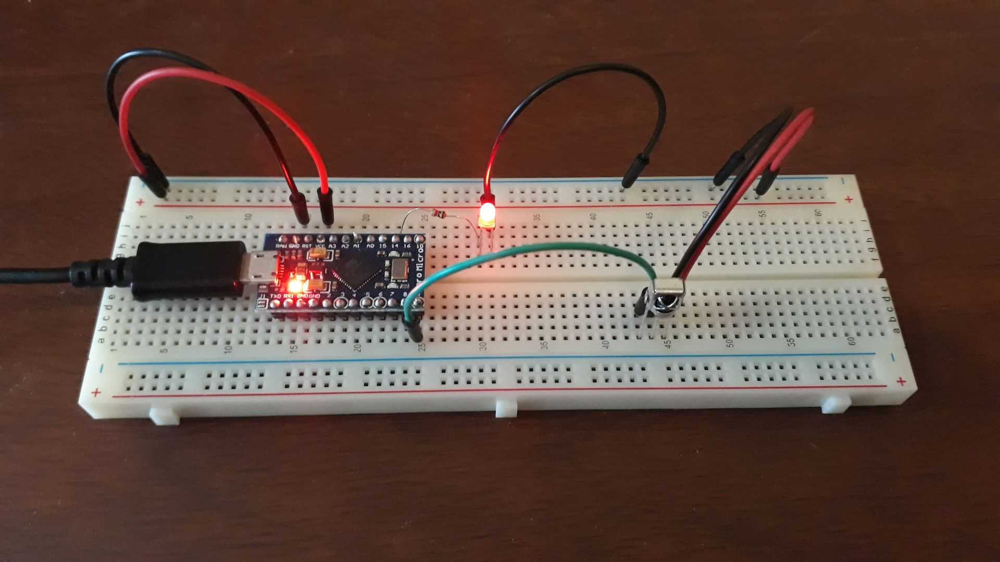
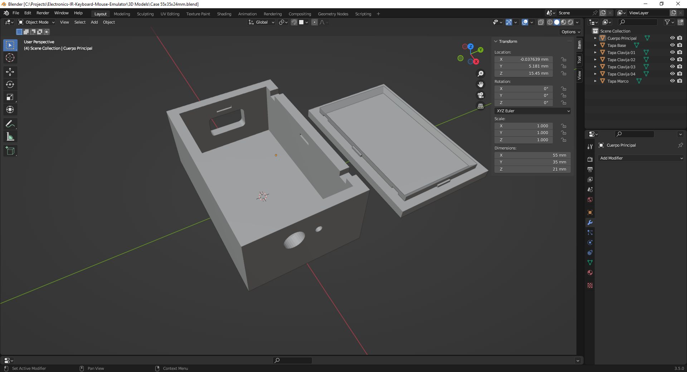
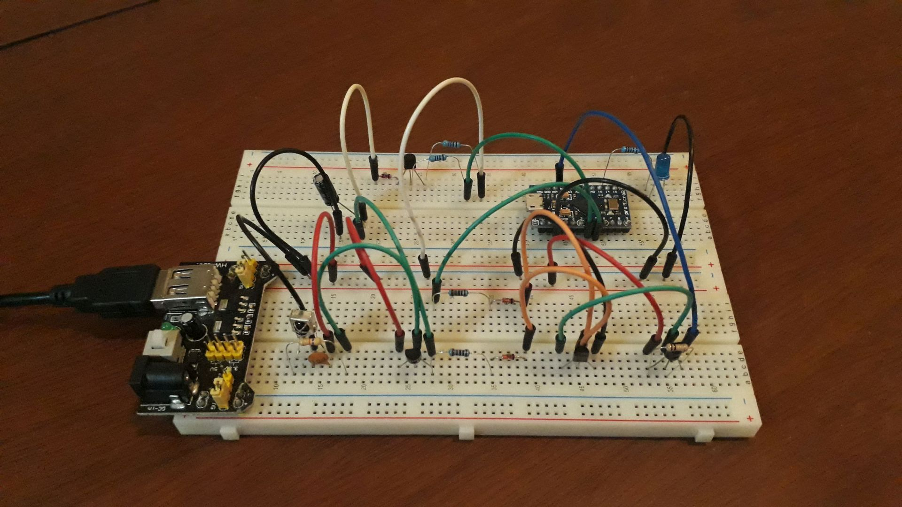
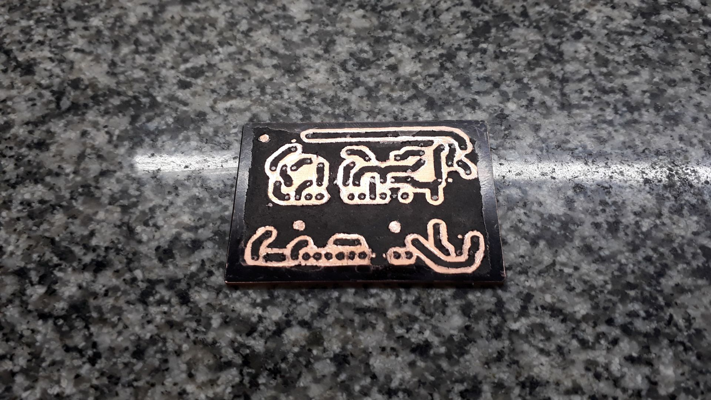
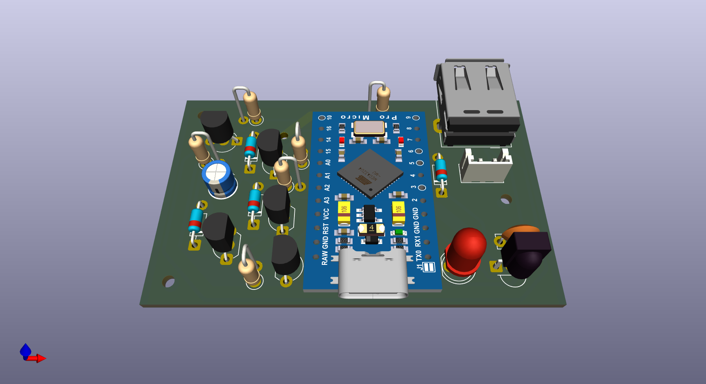

# IR Keyboard+Mouse Emulator

Electronic project for use a IR Remote Control to control a Home Theater PC (HTPC) based on Arduino PRO Micro.  
Schematics diagram + PCB diagram (KiCAD 9) and case 3D model (Blender) are also provided.

This project comes in two versions: `Allways On` and `Low Power`.

- The first option provides an immediate response when a remote control button is pressed.  
However, the gadget will constantly draw approximately 35-40mA from the USB port.

- The second option automatically powers down the device after 30 seconds of inactivity, and it powers back on upon receiving an IR signal.  
This allows the gadget's power consumption to drop 99% of the time to ~1mA (the consumption of the IR sensor, the only component that remains powered on).  
However, due to the power-up time and the wait for the PC to recognize the device, there is a slight delay before it can be used.

&nbsp;

General commands:
- Key Lock/Unlock (to avoid collition with regular TV usage).
- Key Esc
- Key Close (close current program)
- Mouse Change Speed
- Mouse Left Click
- Mouse Right Click
- Mouse MoveUp
- Mouse Move Right
- Mouse MoveDown
- Mouse MoveLeft

Media commands
- Media Player (open VLC media player)
- Media Play/Pause
- Media Stop
- Media Forward (moves forward 10 seconds)
- Media Rewind (moves backwards 10 seconds)
- Media Previous (moves forward 1 minute)
- Media Next (moves backwards 1 minute)
- Media Volume Mute
- Media Volume Up
- Media Volume Down

Miscellaneous commands
- MyPC (opens MyPC)
- Calculator (open Calculator);

Features:
- Dump of IR Codes (protocols: RC5, RC6, NEC, SONY, PANASONIC, LG, JVC, WHYNTER)

Benchmarks:

| Arduino PRO Micro                 | Tipical consumption |
|-----------------------------------|---------------------|
| Normal mode                       |            37-38 mA |
| ADC + SPI + TWI disabled          |            35-36 mA |
| USB detach + Clock @2 MHz         |            19-20 mA |
| USB detach + SLEEP_MODE_PWR_DOWN  |              4-5 mA |

I am currently working on incorporating a hardware low-power version.

&nbsp;

The `Allways ON` version uses the following electronic components:
- 1 x Arduino PRO Micro
- 1 x IR Receiver VS1838
- 1 x LED 3mm
- 1 x 1k ohm resistor

The `Low Power` version uses the following electronic components:
- 1 x Arduino PRO Micro
- 1 x IR Receiver VS1838
- 1 x LED 3mm
- 1 x 1k ohm resistor
- 1 x 47k ohm resistor
- 2 x 10k ohm resistor
- 1 x 100k ohm resistor
- 2 x 4.7k ohm resistor
- 3 x 1N4148 schottky diode
- 1 x 10uF electrolitic capacitor
- 3 x BC547 PNP transistor
- 2 x BC557 NPN transistor
- 1 x USB Type-A female connector
- 1 x Bornier 2-pins / JST connector 2-pins

&nbsp;

### Version Allways On

| Breadboard                                           | Assembly                                             |
|------------------------------------------------------|------------------------------------------------------|
|           |             |

| Schematics Diagram                                   | PCB Diagram                                          |
|------------------------------------------------------|------------------------------------------------------|
|   |          |

| PCB Render 3D                                        | PCB Render 3D                                        |
|------------------------------------------------------|------------------------------------------------------|
|  |   |

| Case 3D Model                                        | Project Final                                        |
|------------------------------------------------------|------------------------------------------------------|
|        |                    |

&nbsp;

### Version Low-Power

| Breadboard                                           | Assembly                                             |
|------------------------------------------------------|------------------------------------------------------|
|            |           |

| Schematics Diagram                                   | PCB Diagram                                          |
|------------------------------------------------------|------------------------------------------------------|
|    |           |

| PCB Render 3D                                        | PCB Render 3D                                        |
|------------------------------------------------------|------------------------------------------------------|
|   |    |

| Case 3D Model                                        | Project Final                                        |
|------------------------------------------------------|------------------------------------------------------|
|         |                    |

See 'Rescources' sub-folder for more pictures & videos of the project.

&nbsp;

### Version History

v1.00 (2025.12.18) - Initial release.  
v1.01 (2025.12.19) - Adding case 3D model.  
v1.02 (2025.12.22) - Update schematics and PCB.  
v1.03 (2025.12.29) - Firmware refactor for code clean-up.  
v1.04 (2026.01.02) - Adding low-power version protoboard & schematics.  
v1.05 (2026.01.03) - Adding low-power version firmware.  
v1.06 (2026.01.04) - Adding low-power version PCB.  
v1.07 (2026.01.04) - Adding low-power case 3D model.  
v1.08 (2026.01.06) - Minor fixes on low-power case 3D model.  
v1.09 (2026.01.09) - Minor fixes on low-power PCB.  
v1.10 (2026.01.14) - Minor fixes on allways-on PCB.  

&nbsp;

This source code is licensed under GPL v3.0  
Please send me your feedback about this project: andres.garcia.alves@gmail.com
